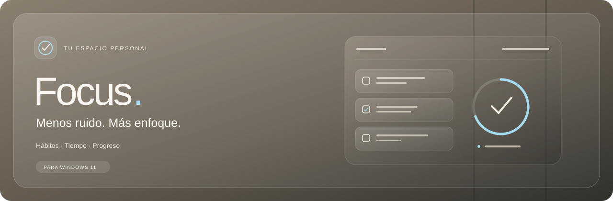
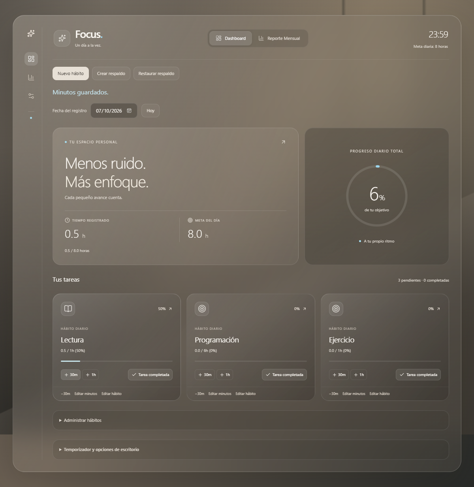
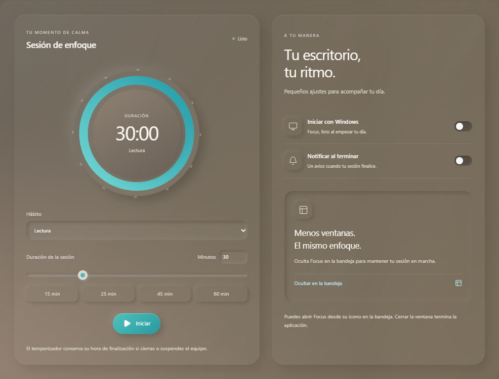

# Focus

**Organiza tus hábitos, registra tus horas y empieza cada día desde cero.** Focus es una aplicación para Windows 11 x64 y Android ARM64, con almacenamiento local, modo oscuro de cristal y modo claro de superficies suaves con acentos turquesa. No requiere cuenta ni conexión a Internet para el uso diario.

[Descargar Focus v0.1.4 para Windows](https://github.com/Rosellpc/Focus/releases/download/v0.1.4/Focus_0.1.4_x64-setup.exe) · [Ver releases](https://github.com/Rosellpc/Focus/releases) · [Notas de v0.1.4](docs/releases/v0.1.4.md)





## Instalación en Windows 11

1. Descarga `Focus_0.1.4_x64-setup.exe` desde el [release v0.1.4](https://github.com/Rosellpc/Focus/releases/tag/v0.1.4).
2. Ejecuta el instalador y sigue el asistente: **Siguiente → Instalar → Finalizar**.
3. Abre **Inicio**, busca **Focus** y ejecútalo. También puedes crear un acceso directo en el escritorio desde la ubicación del acceso directo en Inicio.

El instalador es para Windows **x64** y el usuario actual. No necesitas Node, Rust ni una terminal para usar la aplicación instalada. Focus utiliza Microsoft Edge WebView2; si falta, el instalador puede descargarlo, por lo que ese paso requiere Internet. La firma del updater permite comprobar las actualizaciones; no es una firma Authenticode de Windows.

El release incluye `SHA256SUMS.txt` para comprobar el archivo descargado. Desde PowerShell, en la carpeta de descargas:

```powershell
Get-FileHash .\Focus_0.1.4_x64-setup.exe -Algorithm SHA256
```

Compara el resultado con el checksum publicado.

## Instalación en Android

1. Descarga [Focus_0.1.4_arm64.apk](https://github.com/Rosellpc/Focus/releases/download/v0.1.4/Focus_0.1.4_arm64.apk) en tu teléfono.
2. Abre el APK desde Descargas y permite instalar desde ese navegador o gestor si Android lo solicita.
3. Confirma la instalación. Si ya tienes Focus de producción, actualiza **sin desinstalar** para conservar los datos.

Requiere Android 7.0 o superior y un dispositivo ARM64. No necesitas Android Studio para instalarlo. El APK de depuración usa otra firma: consulta [la guía Android](docs/android-release.md) antes de sustituirlo.

## Qué puedes hacer

- **Crear y editar hábitos:** define el nombre y la meta diaria en minutos. Las metas nuevas se aplican desde el día de la edición y conservan el historial anterior.
- **Registrar tiempo:** suma 30 minutos o una hora, resta 30 minutos o edita el total. Se permiten minutos por encima de la meta, hasta 1440 por hábito y día.
- **Completar una tarea:** el botón **Tarea completada** registra como mínimo las horas de su meta, sin duplicar el tiempo ya registrado. La card desaparece para esa fecha; sus horas siguen contando en el progreso y los reportes. Al día siguiente reaparece con cero minutos.
- **Recuperar una tarea completada:** abre **Tareas completadas → Volver a mostrar**. Las horas se conservan para que puedas corregirlas.
- **Consultar días anteriores:** cambia **Fecha del registro** para revisar o corregir el historial. La app utiliza la fecha local del dispositivo y actualiza el día al llegar la medianoche o volver de suspensión.
- **Consultar reportes mensuales:** revisa horas acumuladas, porcentaje de cumplimiento, mejor categoría y comparación con el mes anterior. Las metas corresponden al mes completo y respetan el historial de metas y períodos activos.
- **Archivar y reactivar hábitos:** conserva sus registros y los períodos en que estuvieron activos. Archivar excluye la meta desde ese día; los minutos registrados siguen en los reportes.
- **Usar el temporizador:** selecciona un hábito y una duración. **Guardar sesión** confirma los minutos; **Terminar y guardar** registra los minutos completos transcurridos. La sesión conserva su fecha de inicio y hora de finalización si cierras o suspendes el equipo.

El selector **White/Beige** de la cabecera recuerda el tema elegido en cada dispositivo. White es el tema predeterminado cuando no hay una elección guardada. El icono de la app en Windows y Android utiliza la misma estrella Sparkles que aparece junto a Focus.

La interfaz adapta sus paneles al ancho de la ventana y respeta la preferencia de movimiento reducido. Los cambios de nombre y color también se reflejan en reportes anteriores.

## Audio personalizado

En el panel del temporizador puedes cargar un ringtone o una canción completa desde el teléfono o PC, probarla, detenerla y volver al sonido predeterminado. Se admiten archivos de audio compatibles de hasta 50 MB. El archivo queda guardado localmente en ese dispositivo y se reproduce una vez completo al terminar la sesión con **Notificar al terminar** habilitado.

La reproducción requiere que Focus esté ejecutándose. En Android, el sistema puede suspender la app al bloquear la pantalla o enviarla al fondo; no es una alarma garantizada con la app cerrada. El audio no se incluye en el respaldo JSON de hábitos.


## Opciones de escritorio

Abre **Temporizador y opciones de escritorio**, o su acceso en la navegación lateral:

- **Iniciar con Windows:** activa esta opción desde la versión instalada para registrar su ubicación definitiva.
- **Notificar al terminar:** habilita las notificaciones de sesiones. Se muestran mientras Focus está ejecutándose, incluso si lo ocultaste en la bandeja.
- **Ocultar en la bandeja:** mantiene la app funcionando. Su icono permite abrir, ocultar o salir de Focus.

Cerrar la ventana termina la aplicación. Abrir Focus por segunda vez activa la ventana existente.

## Datos, respaldos y actualización

Los hábitos, minutos, tareas completadas y metas se guardan en SQLite, en `dailyfocus.db`, dentro de la carpeta de configuración de la app: normalmente `%APPDATA%\com.focus.app\` en Windows.

En Android, los datos permanecen en el almacenamiento privado de la app. Cada dispositivo mantiene su propia base; no hay sincronización automática entre PC y móvil.

En Android, **Crear respaldo** escribe en el almacenamiento privado; la interfaz actual no ofrece exportación mediante Compartir. Consulta [datos y respaldos](docs/user-guide.md) antes de considerar ese archivo una copia externa recuperable.

**Crear respaldo** guarda un JSON completo en la subcarpeta `backups`. **Mostrar respaldo** abre su ubicación en el Explorador. Copia ese archivo a otra unidad para protegerte ante un fallo del disco.

**Restaurar respaldo** valida el archivo y pide confirmación. Antes de reemplazar los datos, guarda una copia de los registros actuales. La restauración se ejecuta en una transacción: si falla, la base anterior se conserva. Los respaldos contienen información personal de tus hábitos; no los subas al repositorio.

Para actualizar Focus:

1. Crea un respaldo.
2. Cierra la app.
3. Ejecuta el instalador de la versión nueva y abre Focus otra vez.

Se conserva el identificador `com.focus.app` para mantener la ubicación de los datos. Las migraciones de SQLite son versionadas y transaccionales. La interfaz muestra los errores de guardado y confirma las operaciones antes de reflejarlas en el contador.

## Desarrollo

Stack: **Tauri 2 · React 19 · TypeScript · Tailwind CSS 4 · SQLite/SQLx**.

Requisitos de compilación en Windows:

- Node.js 22.12 o superior dentro de la rama 22, o una versión superior compatible con Vite, y pnpm.
- Rust estable con el toolchain MSVC y Cargo disponible en el `PATH`.
- Visual Studio con herramientas C++ de escritorio y Windows SDK.
- Microsoft Edge WebView2. Las pruebas de interfaz utilizan Microsoft Edge.

```bash
git clone https://github.com/Rosellpc/Focus.git
cd Focus
pnpm install --frozen-lockfile
pnpm tauri dev
```

Validación:

```bash
pnpm build
pnpm test
pnpm test:ui
cargo test --manifest-path src-tauri/Cargo.toml --lib
```

Las pruebas de interfaz simulan los comandos Tauri. Las pruebas Rust utilizan SQLite real en bases aisladas para verificar migraciones, guardados simultáneos, tareas completadas, restauración y persistencia después de reabrir.

Crear el instalador:

```bash
pnpm tauri build
```

El archivo se genera en `src-tauri/target/release/bundle/nsis/`. En PowerShell, si la política de scripts bloquea `pnpm.ps1`, usa `pnpm.cmd`.

El icono usa el mismo componente Sparkles de la cabecera. Los archivos fuente están en `public/focus.svg` y `public/focus-icon.json`; se regeneran para Windows y Android con:

```bash
pnpm icons
```

## Actualizaciones desde Focus

Windows busca nuevas versiones al abrir Focus y permite instalarlas con **Actualizar ahora**, verificando la firma del updater. En Android, el panel **Focus · Actualizaciones** busca releases estables y ofrece **Descargar actualización**: abre el APK oficial en el navegador y Android pide confirmar la instalación. Guarda o descarta la sesión del temporizador y cierra los formularios antes de actualizar.

Si ya tienes Android `0.1.3`, abre Focus con Internet y pulsa **Buscar actualizaciones** para comprobar la actualización a `0.1.4`. Instálala sin desinstalar y revisa que se conserven tus hábitos. Si no hay conexión o GitHub limita las consultas, puedes seguir usando Focus y reintentar.

GitHub Actions genera Windows y Android al subir una etiqueta `vX.Y.Z`. El release permanece en borrador hasta verificar ambos instaladores, firmas y checksums. La firma Android permanente permite actualizar las instalaciones existentes.

## Documentación del proyecto

- [Uso, datos y respaldos](docs/user-guide.md).
- [Desarrollo y estructura](docs/development.md).
- [Compilación y firma Android](docs/android-release.md).
- [Publicación y recuperación de GitHub Actions](docs/releasing.md).
- [Notas de 0.1.4 y prueba de actualización Android](docs/releases/v0.1.4.md).
- [Historial de releases](docs/releases/README.md).
