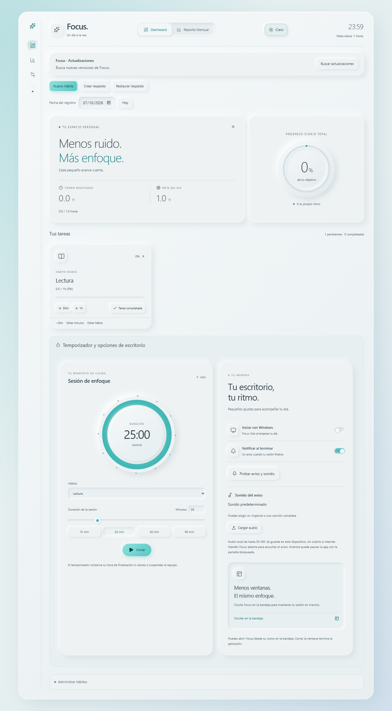

# Focus v0.1.3

Icono de Focus unificado en Windows y Android: el mismo Sparkles de la
cabecera, en turquesa sobre fondo claro. Incluye iconos Android adaptativos,
redondos y monocromos. Regenerar con `pnpm icons`; el dibujo procede del
mismo componente Lucide usado por Header.

Sonido personalizado para el fin de la sesion: cargar un ringtone o una
cancion completa desde el movil o PC, probar, detener y volver al sonido
predeterminado. Audio compatible de hasta 50 MB, guardado localmente en el
dispositivo. No se envia a servidores ni se incluye en el respaldo JSON de
habitos. Se reproduce una vez completo mientras Focus esta abierta; en
Android el sistema puede pausar la app con la pantalla bloqueada. No es una
alarma del sistema con la app cerrada.

Modo claro opcional inspirado en superficies neumorficas blancas y acentos
turquesa. El selector Claro/Oscuro de la cabecera recuerda la eleccion en
Windows y Android. El tema cubre tareas, reportes, formularios y temporizador.



Android busca actualizaciones al abrir Focus y permite volver a comprobarlas.
Descargar actualizacion abre el APK oficial de GitHub. Android pide confirmar
la instalacion; actualiza sin desinstalar Focus para conservar los datos.
Guarda o descarta la sesion del temporizador antes de actualizar.

GitHub Actions genera y firma Windows x64 y Android ARM64. El release sigue
en borrador hasta verificar ambos instaladores, sus firmas y checksums.

## Primera instalacion

Android 0.1.2 no contiene el panel. Instala el APK firmado de 0.1.3 una vez
sobre 0.1.2 usando `adb install -r "ruta-del-apk"` o abriendolo en Descargas.
Se conserva la firma permanente y los datos.

## Secrets de GitHub

En https://github.com/Rosellpc/Focus/settings/secrets/actions crear:

- `ANDROID_KEYSTORE_BASE64`: `.android-signing/focus-release.jks` en Base64.
- `ANDROID_KEY_PASSWORD`: el contenido de `.android-signing/password.txt`.

El alias `focus-release` y la huella del certificado estan fijados para
rechazar una firma distinta. Conserva los Secrets de Windows.

Copiar cada secreto al portapapeles sin imprimirlo, desde PowerShell:

```powershell
Set-Clipboard -Value ([Convert]::ToBase64String([IO.File]::ReadAllBytes('C:\MiApp\Focus\.android-signing\focus-release.jks')))
```

Pegar en `ANDROID_KEYSTORE_BASE64`. Luego:

```powershell
Set-Clipboard -Value ([IO.File]::ReadAllText('C:\MiApp\Focus\.android-signing\password.txt').Trim())
```

Pegar en `ANDROID_KEY_PASSWORD` y limpiar con `Set-Clipboard -Value ''`.
No envies los valores al chat ni los publiques.

## Publicacion

Guardar en Git los fuentes del proyecto Android generado, Gradle y wrapper.
Los caches, compilaciones y secretos estan excluidos. Subir los cambios y
crear la etiqueta `v0.1.3`. El workflow requiere versiones coherentes en
package.json, tauri.conf.json y Cargo.toml. No reutilizar etiquetas publicadas.

La app consulta la API publica de releases estables de GitHub. Errores de red,
limites de consultas o releases nuevos sin APK permiten reintentar. Valida
versiones numericas y acepta solo la URL del APK de Rosellpc/Focus para esa
version. Android comprueba la firma al instalar. La descarga se realiza en
el navegador, que puede pedir permiso para instalar desde esa fuente.
No hay instalacion silenciosa ni actualizaciones sin confirmacion.
